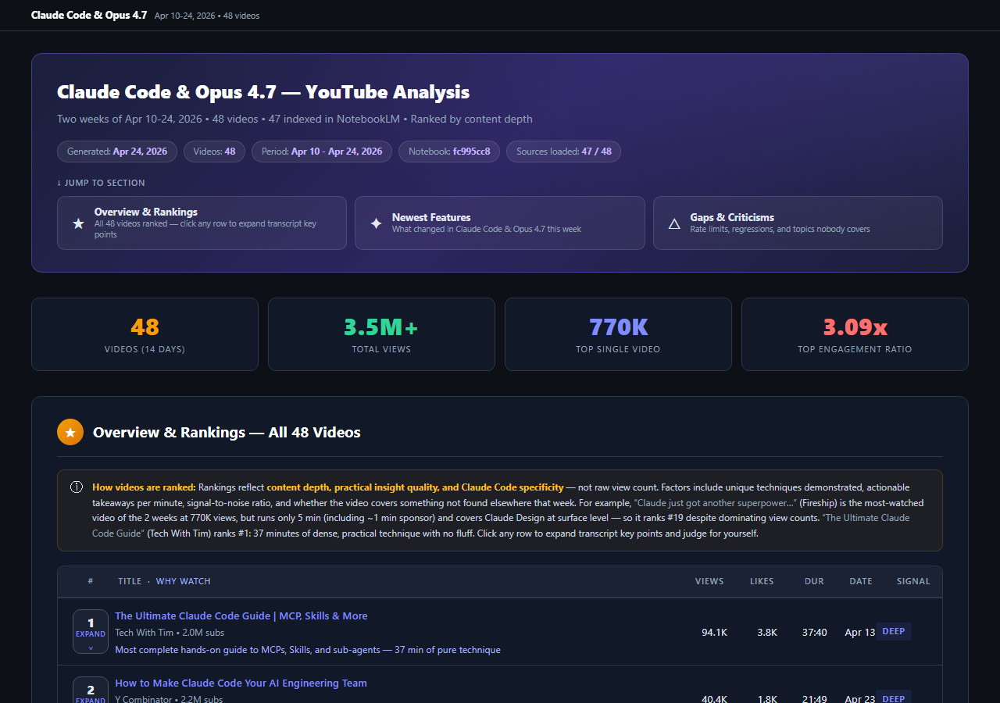

# youtube-research

Deutschsprachiges Plugin-Bundle für Claude Code, das drei aufeinander abgestimmte
Skills zu einer vollständigen YouTube-Recherche-Pipeline kombiniert.

---

## Die drei Skills im Überblick

```
youtube-search          →  youtube-research-pipeline  ←  notebooklm
(Videos finden)             (Orchestrierung)              (KI-Analyse)
```

| Skill | Aufgabe |
|-------|---------|
| **youtube-search** | Sucht YouTube mit `yt-dlp`, liefert strukturierte Ergebnisse mit Metadaten (Aufrufe, Abonnenten, Dauer, Engagement-Verhältnis) |
| **notebooklm** | Automatisiert Google NotebookLM - lädt Quellen, stellt Fragen, generiert Deliverables (Podcast, Quiz, Karteikarten, Infografik usw.) |
| **youtube-research-pipeline** | Orchestriert den gesamten Ablauf: Suche starten, Ergebnisse filtern, in NotebookLM laden, KI-Analyse durchführen, Markdown- und HTML-Bericht erstellen |

### Wie die Skills zusammenarbeiten

```
Nutzeranfrage
     |
     v
[youtube-search]
  - Führt yt-dlp-Suche durch (--count 10 --months 24)
  - Filtert Business-/Hustle-Videos heraus
  - Liefert Titel, URL, Kanal, Aufrufe, Engagement
     |
     v
[notebooklm]
  - Erstellt Notizbuch oder verwendet vorhandenes
  - Fügt alle Video-URLs als Quellen hinzu (--wait)
  - Stellt die Analysefrage des Nutzers
  - Generiert optionales Deliverable (Karteikarten, Quiz etc.)
     |
     v
[youtube-research-pipeline]
  - Fasst alles zusammen
  - Schreibt Markdown-Bericht nach Output/<thema>-recherchebericht.md
  - Generiert HTML-Bericht nach Output/JJJJMMTT_<thema>.html
  - Öffnet den HTML-Bericht im Browser
```

---

## Voraussetzungen

### Python-Pakete installieren

```bash
pip install yt-dlp
pip install notebooklm-py
pip install "notebooklm-py[browser]"
playwright install chromium
```

### NotebookLM einmalig authentifizieren

```bash
notebooklm login
```

Ein Chromium-Fenster öffnet sich. Mit dem Google-Konto anmelden. Die
Anmeldedaten werden unter `~/.notebooklm/storage_state.json` gespeichert
und bei allen späteren Befehlen automatisch verwendet.

### Installation prüfen

```bash
yt-dlp --version
notebooklm status
```

---

## Verwendung in Claude Code

Das Bundle wird automatisch ausgelöst, wenn die Anfrage eine Kombination aus
YouTube-Suche und Analyse enthält. Typische Trigger-Phrasen:

- "Recherchiere [Thema] mit YouTube"
- "Nutze die YouTube-Recherche-Pipeline für [Thema]"
- "Finde und analysiere YouTube-Videos über [Thema]"
- "YouTube + NotebookLM: [Thema]"
- "Ich möchte über [Thema] aus YouTube-Videos lernen"

Für reine Videosuche ohne Analyse wird nur `youtube-search` ausgelöst.
Für reine NotebookLM-Aufgaben (z.B. Podcast aus PDFs) wird nur `notebooklm` ausgelöst.
Die Pipeline-Skill verbindet beide für end-to-end-Recherche.

---

## Beispiel - Claude Code auf YouTube recherchieren

### Anfrage an Claude Code

```
Was gibt es Neues bei Claude Code & Opus 4.7 auf YouTube — letzte 2 Wochen
(10.-24. April 2026)? Analysiere die aktuellsten Videos und fasse zusammen,
welche neuen Features, Workflows und Community-Reaktionen es gibt.
```

### Was Claude Code dann tut

**Schritt 1 - YouTube-Suche**

```bash
python youtube-search/scripts/search_youtube.py "Claude Code Opus 4.7" --count 48 --months 1
```

Beispiel-Ergebnisse (gefiltert, Business-Content entfernt):

```
#01  Claude Code & Opus 4.7 - Everything New in Two Weeks
      Channel:    Fireship  (2.8M subscribers)
      Views:      504.9K   Duration: 1:36:00   Uploaded: Apr 24, 2026
      Engagement: 3.09x
      URL:        https://www.youtube.com/watch?v=...

#02  Claude Code Tips - Apr 10-24 2026
      Channel:    Theo - t3.gg  (320K subscribers)
      Views:      770K     Duration: 0:42:11   Uploaded: Apr 22, 2026
      Engagement: 1.12x
      URL:        https://www.youtube.com/watch?v=...
...
```

**Schritt 2 - NotebookLM-Notizbuch erstellen**

```bash
notebooklm create "Claude Code & Opus 4.7 - Apr 10-24 2026"
notebooklm use <notizbuch_id>
notebooklm source add https://www.youtube.com/watch?v=... --wait
# (für alle 48 Videos wiederholt)
```

**Schritt 3 - KI-Analyse**

```bash
notebooklm ask "Was sind die wichtigsten neuen Features, Workflows und \
Community-Reaktionen zu Claude Code & Opus 4.7 in den letzten 2 Wochen?" --json \
> Output/notebooklm_response.json
```

**Schritt 4 - Bericht erstellen**

Claude Code schreibt automatisch:
- `Output/20260424_claude_code_2weeks.md` - vollständiger Markdown-Bericht
- `Output/20260424_claude_code_2weeks.html` - visueller HTML-Bericht (dunkel, interaktiv)

### Auszug aus dem generierten Bericht

```markdown
# Claude Code & Opus 4.7 - YouTube Analysis

Two weeks of Apr 10-24, 2026

**Datum:** 24.04.2026
**Analyseziel:** Neue Features, Workflows und Community-Reaktionen
**NotebookLM-Notizbuch:** abc123...

## YouTube-Quellen

| # | Titel | Kanal | Aufrufe | Engagement | URL |
|---|-------|-------|---------|------------|-----|
| 1 | Claude Code & Opus 4.7 - Everything New... | Fireship | 504.9K | 3.09x | Link |
| 2 | Claude Code Tips Apr 10-24 2026 | Theo - t3.gg | 770K | 1.12x | Link |
...

## Analyse

Die analysierten Videos der letzten zwei Wochen zeigen:

1. **Opus 4.7 deutlich stärker bei komplexen Aufgaben** - Community-Konsens:
   Opus 4.7 loest mehrstufige Coding-Tasks zuverlaessiger als Vorgaenger...
2. **Claude Code als vollstaendiger Entwicklungspartner** - Videos zeigen,
   wie Teams komplette Features ohne manuelle Code-Reviews deployen...
3. **3.5M Gesamtaufrufe in 2 Wochen** - Hoechstes Engagement aller bisherigen
   Claude-Releases laut Kanal-Statistiken...

## Suchmetadaten

| Feld | Wert |
|------|------|
| Suchanfrage | Claude Code Opus 4.7 |
| Abgerufene Ergebnisse | 48 |
| Zeitfenster | 10.-24. April 2026 (2 Wochen) |
| Gesamtaufrufe | 3.5M |
```

### Vorschau - HTML-Bericht

Der generierte HTML-Bericht ist ein interaktiver Dark-Mode-Report mit Engagement-Metriken,
Videoranking, KI-Analyse und optionalen Deliverables (Karteikarten, Quiz, Podcast usw.).



---

## Ordnerstruktur

```
youtube-research/
├── SKILL.md                              - Einstiegspunkt, Routing-Tabelle
├── README.md                             - Diese Datei
├── assets/
│   └── output-example.png               - Vorschau des generierten HTML-Berichts
├── scripts/
│   └── search_youtube.py                 - yt-dlp Suchskript
└── references/
    ├── youtube-search.md                 - YouTube-Suchanleitung
    ├── youtube-research-pipeline.md      - Pipeline-Orchestrierung (Deutsch)
    ├── html-design-system.md             - CSS/Layout/Toggle-JS fuer HTML-Berichte
    └── notebooklm.md                     - NotebookLM CLI-Anleitung
```

---

## Autor

André Rausch - [andre.rausch@infomotion.de](mailto:andre.rausch@infomotion.de)  
INFOMOTION GmbH
